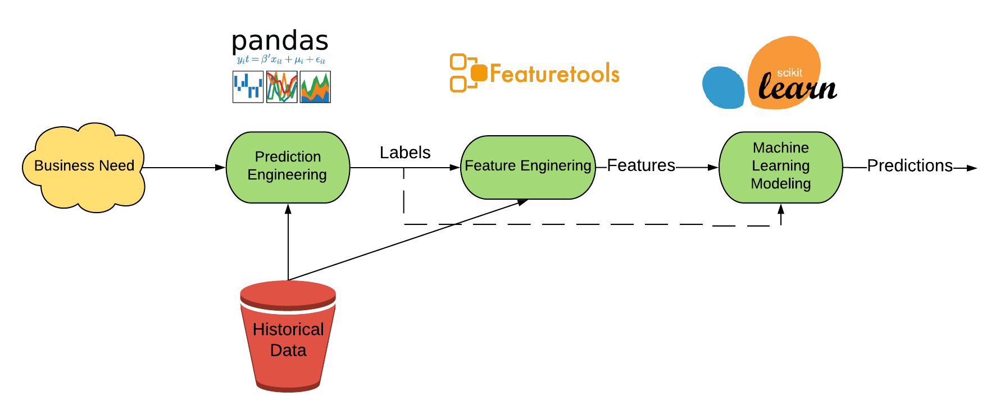

# Predicting Customer Churn with a Machine Learning Scaffolding

This project demonstrates applying a 3-step framework to solve problems with machine learning. The purpose of this framework
is to provide a scaffolding for rapidly developing machine learning solutions.

# Framework Steps

1. __Prediction engineering__
  * State business need
  * Translate business requirement into machine learning task
  * Develop set of labels along with cutoff times for supervised machine learning prediction problem
2. __Feature Engineering__
  * Create features - predictor variables - out of raw data 
  * Use cutoff times to make valid features for each label
  * Apply automated feature engineering to automatically make hundreds of relevant, valid features 
3. __Modeling__
  * Train a machine learning model to predict labels from features
  * Use a pre-built solution with common libraries
  * Optimize model in line with business objectives

Machine learning currently is an ad-hoc process requiring a custom solution to be built for each problem. Even for the same dataset,
a slightly different prediction problem requires a solution to be built from scratch. This has made it too difficult for many companies
to take advantage of the benefits of machine learning. A standardized procedure will make it easier to solve meaningful problems
with machine learning, allowing an application of this transformative technology to a wider range of use-cases.

# Results

# Notebooks

